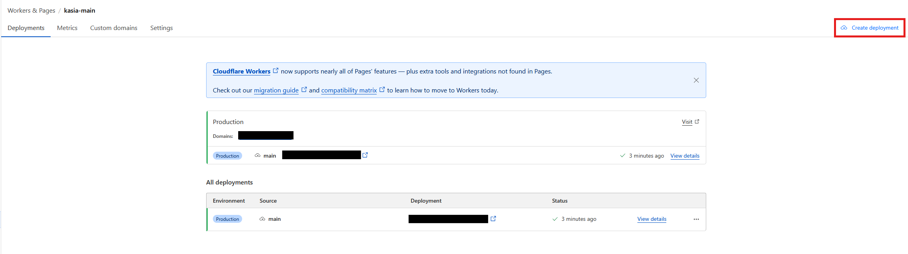

# On CloudFlare Pages

1. `npm run build`, if you made changes to `/cipher`, make sure to build `cipher-wasm` via `cd cipher && wasm-pack build --target web --release -d ../cipher-wasm` first.
2. compress the content of the resulting build contained in `/dist` (not `/dist` but all of the content in it), in `.zip` format.
3. go to cloudflare pages, on the project, click `Create Deployment`
   
4. upload the `.zip` file and click `Save and Deploy`

Alternatively, if you wish to deploy a "staging" or "beta" version, you can tick `preview` while uploading the compressed build file. This will create a new application that will be up for testing, prior publishing it to production.
